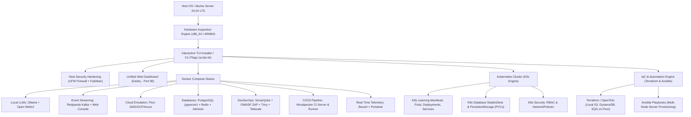

# DevLab: Multi-Architecture Internal Development, Kubernetes, DevSecOps & Local LLM Laboratory

[](https://ubuntu.com)
[](https://docker.com)
[](https://k3s.io)
[](https://ollama.com)
[](https://redpanda.com)
[](https://github.com/floci-io)
[](https://sonarqube.org)
[](https://terraform.io)

Transform your hardware—whether a **Lenovo ThinkPad / PC (x86_64, 32GB RAM)** or a **Raspberry Pi 4/5 (ARM64, 4GB/8GB RAM)**—into a state-of-the-art, fully containerized **Internal Development, AI, Event Streaming, Kubernetes & DevSecOps Laboratory**.

---

## 🌟 Key Capabilities

- **Interactive TUI Installer Wizard (`script.sh`)**: Terminal User Interface powered by `whiptail` that auto-detects CPU architecture (`x86_64` vs `arm64`), total RAM, and storage space, dynamically calibrating recommended LLM models.
- **Local AI & Coding Assistant Stack**: Containerized **Ollama** engine paired with **Open WebUI** and OpenAI-compatible API endpoint (`http://localhost:11434/v1`) for VS Code / Antigravity / Continue.dev integration.
- **Event Streaming & Messaging (Kafka / Redpanda)**: High-performance C++ Kafka-compatible engine (**Redpanda**) running in KRaft mode (zero ZooKeeper required) with web console UI to inspect topics, messages, consumer groups, and schemas.
- **Offline Cloud Emulation with Floci**: Emulate AWS/GCP/Azure services (S3, DynamoDB, SQS, SNS, Lambda) locally without cloud accounts using [Floci.io](https://github.com/floci-io).
- **Infrastructure as Code (Terraform) & Automation (Ansible)**: Provision local cloud resources using Terraform against Floci local endpoints and manage multi-node deployments over SSH with Ansible playbooks.
- **Databases & AI Vector Store**: **PostgreSQL 16** with `pgvector` extension for RAG (Retrieval-Augmented Generation) applications, **Redis 7** for caching/queues, and **Adminer** for visual web management.
- **DevSecOps & Code Quality Suite**: **SonarQube Community Edition** for SAST code scanning, **OWASP ZAP** for DAST web app security testing, **Trivy** for vulnerability scanning, **UFW + Fail2ban** for host hardening, and **Tailscale** for zero-trust remote access.
- **Lightweight Kubernetes (K3s)**: Full learning path with pre-configured manifests for Namespaces, Pods, Deployments, Services, Ingress, and **StatefulSets** with Persistent Volume Claims.
- **Unified Real-time Control Center**: Single-page dashboard (**Dashy**), sub-second hardware telemetry (**Beszel/Netdata**), live container control (**Portainer**), and live CI/CD pipeline tracking (**Woodpecker CI**).

---

## 📐 Architecture & Components Overview



---

## ⚡ Quick Start

### Option 1: Zero-Touch Headless Flash (Cloud-Init)

1. Flash **Ubuntu Server 24.04 LTS** onto your MicroSD/NVMe using **Raspberry Pi Imager** or `dd`.
2. Copy [`cloud-init/user-data.example`](file:///Users/usermone/local/projects/ubuntu_raspberry_pi_4/cloud-init/user-data.example) to the boot partition as `user-data`.
3. Power on the device. It will automatically configure Wi-Fi/LAN, set up your SSH keys, update packages, and enable UFW + Fail2ban.

### Option 2: Interactive Installer Wizard

Clone the repository on your Ubuntu server or workstation and run:

```bash
git clone https://github.com/LeopoldoIII/ubuntu_raspberry_pi_4.git
cd ubuntu_raspberry_pi_4

# Launch the interactive terminal wizard
make install
# or directly:
chmod +x script.sh && ./script.sh
```

### Option 3: Automated CLI / Makefile Execution

Run specific stacks or unattended full installation:

```bash
# Unattended full setup
make setup

# Individual Stack & IaC Control
make up-monitoring # Start Dashy Dashboard, Beszel Telemetry & Portainer
make up-db         # Start PostgreSQL (pgvector), Redis & Adminer
make up-kafka      # Start Redpanda Kafka & Web Console
make up-llm        # Start Ollama & Open WebUI
make up-security  # Start SonarQube, OWASP ZAP, Trivy & Tailscale
make up-cicd      # Start Woodpecker CI Engine
make up-floci     # Start Floci Cloud Emulators
make tf-apply     # Run Terraform IaC against local Floci cloud emulator
make ansible-play # Run Ansible playbook across nodes
make k3s-up       # Install K3s Kubernetes Engine
```

---

## 🛠️ Infrastructure as Code (Terraform) & Ansible

- **Terraform / OpenTofu (`terraform/main.tf`)**: Test real Terraform configurations (`terraform apply`) against your local Floci cloud emulator without requiring AWS accounts or incurring cloud charges!
- **Ansible (`ansible/playbook.yml`)**: Manage, update, and deploy software across multiple nodes (ThinkPad + Raspberry Pis) simultaneously over SSH using standard playbooks.

---

## 🌐 Unified Web Control Console Directory

Once started, open your browser to `http://<server-ip>`:

| Service Name | Web Console URL | Description / Role |
| :--- | :--- | :--- |
| **Unified Command Center** | `http://<ip>:80` | **Dashy Dashboard** with live service health badges |
| **Hardware Telemetry Console** | `http://<ip>:8090` | **Beszel/Netdata**: Real-time sub-second CPU/RAM/Temp metrics |
| **Docker Manager** | `http://<ip>:9000` | **Portainer**: Real-time container logs & terminal exec |
| **Kafka Event Console** | `http://<ip>:8085` | **Redpanda Console**: Web UI for topics, messages & schemas |
| **Code Quality & OWASP** | `http://<ip>:9000/sonar` | **SonarQube**: SAST code scanning & security hotspots |
| **CI/CD Pipeline Console** | `http://<ip>:8000` | **Woodpecker CI**: Live build & test execution tracking |
| **AI Assistant (Local LLM)** | `http://<ip>:3000` | **Open WebUI**: Local LLM chat & RAG interface |
| **Floci Cloud Emulator** | `http://<ip>:4000` | **Floci UI**: AWS/GCP/Azure local service simulation |
| **Database Explorer** | `http://<ip>:8080` | **Adminer**: Visual web explorer for PostgreSQL & Redis |

---

## 🧠 Local LLM Model Calibration Matrix

The setup engine automatically detects available system RAM and calibrates default model downloads:

| Hardware System | RAM Capacity | Recommended Model | Use Case |
| :--- | :--- | :--- | :--- |
| **Lenovo ThinkPad / PC** | 32 GB RAM | `qwen2.5-coder:7b` / `14b` | High-speed, advanced code autocompletion & reasoning |
| **Mid-tier Server** | 16 GB RAM | `qwen2.5-coder:7b` / `llama3.2:3b` | Great balance of speed and contextual understanding |
| **Raspberry Pi 5 / 4** | 8 GB RAM | `qwen2.5-coder:3b` / `llama3.2:3b` | Lightweight coding assistance & instruction following |
| **Raspberry Pi 4** | 4 GB RAM | `qwen2.5-coder:1.5b` / `deepseek-r1:1.5b` | Ultra-compact edge models with low memory footprint |

---

## ☸️ Kubernetes (K3s) Learning Suite

Pre-configured Kubernetes manifests are located in the `k8s/` directory to practice container orchestration:

```bash
# 1. Create devlab namespaces
kubectl apply -f k8s/00-namespace.yaml

# 2. Deploy PostgreSQL StatefulSet with Persistent Volume Claim
kubectl apply -f k8s/01-postgres-statefulset.yaml

# 3. Apply RBAC and NetworkPolicies for security
kubectl apply -f k8s/02-security-rbac.yaml

# 4. Deploy Ollama, Floci, and Kafka in Kubernetes
kubectl apply -f k8s/03-ollama-deployment.yaml
kubectl apply -f k8s/04-floci-deployment.yaml
kubectl apply -f k8s/06-kafka-deployment.yaml

# 5. Deploy sample microservice app
kubectl apply -f k8s/05-sample-app/deployment.yaml

# Check cluster status
make k8s-status
```

---

## 🛡️ DevSecOps & Security Hardening

- **Firewall**: UFW pre-configured with strict ingress rules.
- **SSH Protection**: Fail2ban active to ban malicious IP attempts.
- **Code Vulnerability Scanning**: Run `make scan-code` to execute **Trivy** vulnerability scanning against local source code and Docker containers.
- **Zero-Trust VPN**: Run `docker compose -f docker/docker-compose.security.yml up -d` to activate **Tailscale** for secure remote access without router port-forwarding.

---

## 📄 License

MIT License. Designed for internal development laboratories, homelabs, and cloud engineering training.
